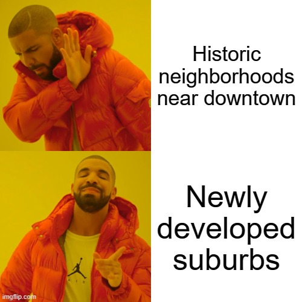

# Phase 2 Project

# Introduction
For this project I looked at the King County housing dataset, King county is the greater Seattle area, to build a model that predicts house prices for homes in the area. The prediction model uses several variables including age (how many years ago the house was built), number of bedrooms and bathrooms, as well as latitude & longitude coordinates. These predictions can be used to give buyers an estimate on the type of house they’re looking to buy, or give sellers insights in pricing their homes as well as possibly increasing the value of their homes.

# The Average Seattle Home
An overview of the average home in the dataset...
3 bedrooms, 2 bathrooms, $540,000, ⅓ acre yard, 3 condition (Average), 1 floor, Built in 1971, Located 19 miles from downtown.
It would something like this...

# Questions
1. How does bathroom to bedroom ratio affect price?

2. What effect does housing condition have on sale price, how does this compare to houses with a waterfront view?
3. In which zip code are houses the oldest on average and what is the average price? What about the newest?
4. How much is the average house over 1 acre and how many beds&baths does it have on average, how does this compare to the dataset as a whole?

# Conclusions
1. According to the simple model, which was built specifically for this question, a price increase of $488,537 for each increase in bathroom to bedroom ratio, for example a 2 bedroom house with 4 bathrooms would cost ~1,194,000 and a 2 bedroom 2 bathroom house would be ~$715k given this variable alone. The motivation for this question is that typically average family homes have more bedrooms than bathrooms while the opposite tends to be true for luxury homes. 

2. Typically homes in better condition cost more, the average house is $341,067 in bad condition, $542,173 in average condition, and $612,577 in very good condition. However this was not the case for waterfront properties. The average price in bad condition is $658,000, and $2,560,000 in fair condition but prom there price decreases as condition improves, this likely contributes to excluded variables.

3. The 98105 zip code which consists mainly of the Laurelhurst neighborhood near the University of Washington is the oldest with the average house being built in 1940. In contrast, the 98053 zip code in the eastern part of Richmond, WAis the newest with the average house being built in 1998. The average house in 98105 is 863229 and the average house in 98053 is slightly cheaper at $677215.

4. The average house over 1 acre is also a 3 bed 2 bath but costs about 23.7 percent more on average. The average house over 2 acres is 675k which is only 24.9 percent more than the 1/3 acre home. Surprisingly enough, The largest property was 38 acres and was only $700,000!

# Recommendations
1. houses with more bathrooms than bedrooms cost significantly more than houses with as many or fewer bathrooms than bedrooms. Not much here, more of a curiosity filler

2. taking the effort to improve the quality of your home is generally worth the effort, especially if your house is currently a 2 (fair) or 4(good). If at all possible you should find out what it's condition is if you want to sell your home at the highest price. But be careful, because the cost of improving the quality may exceed the gains on the sale. Oddly enough the findings are quite different for homes with waterfront, however 'fixer upper' homes on the waterfront may be a good investment opportunity.

 3. If you are looking to save, it is best to avoid homes built before 1960 and historic neighborhoods. Homes further inland are also cheaper on average, if you like being closer to mountains this could work out well for you.
if a big yard is important to you it is well worth the investment to buy a house on a 2 - 2.5 acre yard, provided you can afford it, as you can get 6 to 8 times as much property for only 25% more!

# Future Work
Given more time to work with this data I would build a recommendation system that would recommend the best zip code to buy a home for an individual moving to this area. I would also look into zip code data outside of the dataset.
